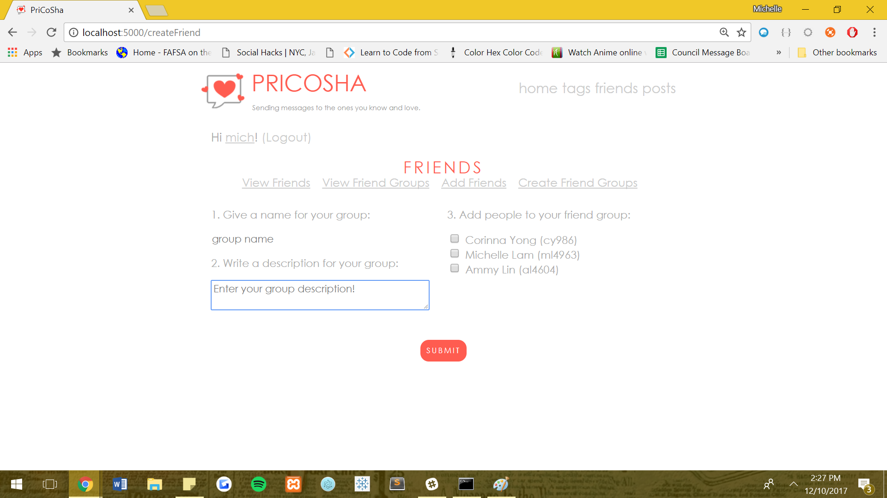
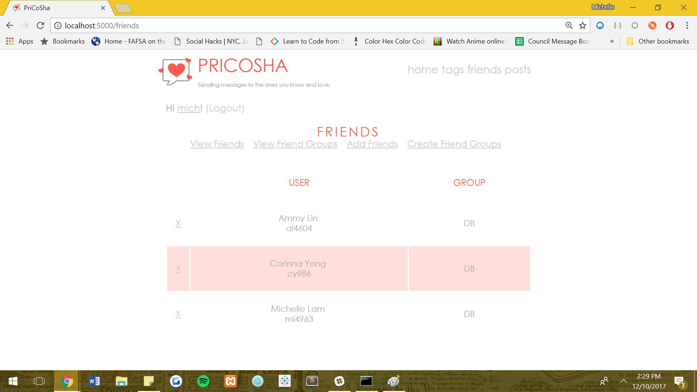
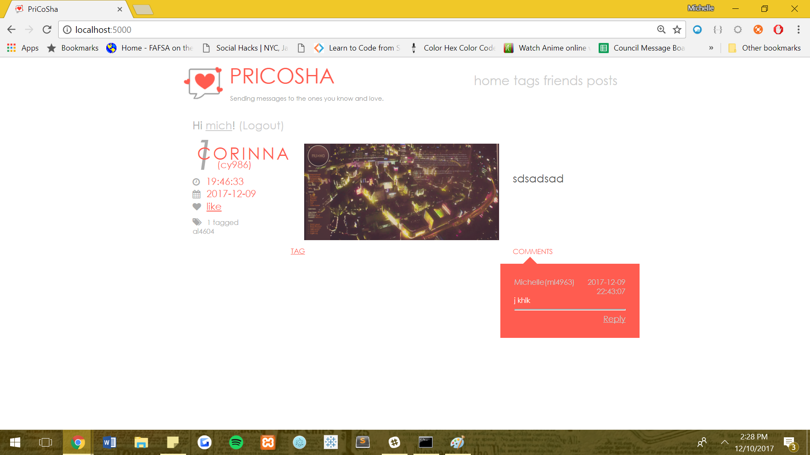

# PriCoSha
A Flask application that allows users to create and share content items among groups of other users.

## How to run
1. Dump database schema (and, optional, the inserts) into a db (name it `pricosha`). And start the SQL server.
2. Run `python init.py` in command prompt or terminal at the root folder of this project.
3. Should be running at `localhost:5000`!

## Available Features
- Login
- View content items and information
- Manage tags
- Post a content item
- Tag a content item
- Add friend
- Feature No. 1 - Create/delete/defriend friend group
- Feature No. 2 - Update/delete content items
- Feature No. 3 - Like/Dislike feature for content item
- Feature No. 4 - Profile page for users
- Feature No. 5 - Add comments

## Screenshots
        
